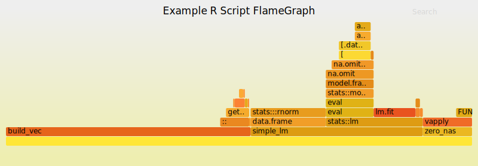

# xrprof

<!-- badges: start -->

[](https://travis-ci.org/atheriel/xrprof)
<!-- badges: end -->

`xrprof` (formerly `rtrace`) is an external sampling profiler for R on Linux.

Many R users will be familiar with using the built-in sampling profiler
`Rprof()` to generate data on what their code is doing, and there are several
excellent tools to facilitate understanding these samples (or serve as a
front-end), including the [**profvis**](https://rstudio.github.io/profvis/)
package.

However, the reach of `Rprof()` and related tools is limited: the profiler is
"internal", in the sense that it must be manually switched on to work, either
during interactive work (for example, to profile an individual function), or
perhaps by modifying the script to include `Rprof()` calls before running it
again.

In contrast, `xrprof` can be used to profile code that is *already running*:

```console
$ Rscript myscript.R &
# sudo may be required.
$ xrprof -p <PID> -F 50 > Rprof.out
```

External sampling profilers have proven extremely useful for diagnosing and
fixing performance issues (or other bugs) in production environments. This
project joins a large list similar tools for other languages, such as `perf`
(the Linux system profiler), `jstack` (for Java), `rbspy` (for Ruby), `Pyflame`
(for Python), `VSPerfCmd` for C#/.NET, and many others.

## Building

A simple `Makefile` is provided. Build the binary with

```console
$ make
```

To install the profiler to your system, use

```console
$ sudo make install
```

This will install the binary to `/usr/local/bin` and use `setcap` to mark it for
use without `sudo`. The `install` target supports `prefix` and `DESTDIR`.

## Usage

The profiler has a simple interface:

    Usage: xrprof [-F <freq>] [-d <duration>] -p <pid>

The `Rprof.out` format is written to standard output and errors or other
messages are written to standard error.

Along with the sampling profiler itself, there is also a `stackcollapse-Rprof.R`
script in `tools/` that converts the `Rprof.out` format to one that can be
understood by Brendan Gregg's [FlameGraph](http://www.brendangregg.com/flamegraphs.html)
tool. You can use this to produce graphs like the one below:

```shell
$ stackcollapse-Rprof.R Rprof.out | flamegraph.pl > Rprof.svg
```



## Okay, How Does it Work?

Much like other sampling profilers, the program uses Linux's `ptrace` system
calls to attach to running R processes and a mix of `ptrace` and
`process_vm_readv` to read the memory contents of that process, following
pointers along the way.

The R-specific aspect of this is to locate and decode the `R_GlobalContext`
structure inside of the R interpreter that stores information on the currently
executing R code.

In order to "defeat" address space randomization, the profiler will also load
`libR` into memory and then locate the offset of the global context structure.

## Credits

The project was inspired by Julia Evan's blog posts on writing
[`rbspy`](https://rbspy.github.io/) and later by my discovery of Evan Klitzke's
work (and writing) on [Pyflame](https://github.com/uber/pyflame).

## License

This project contains portions of the source code of R itself, which is
copyright the R Core Developers and licensed under the GPLv2.

The remaining code is copyright its authors and also available under the same
license, GPLv2.
